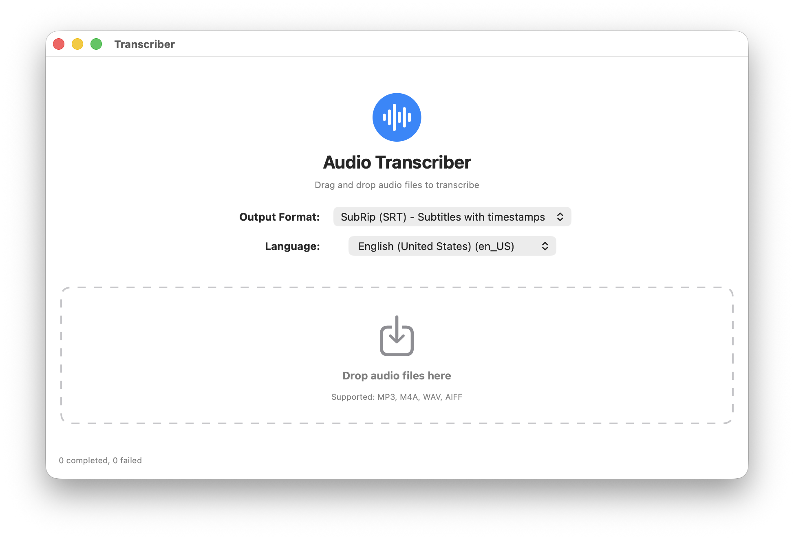
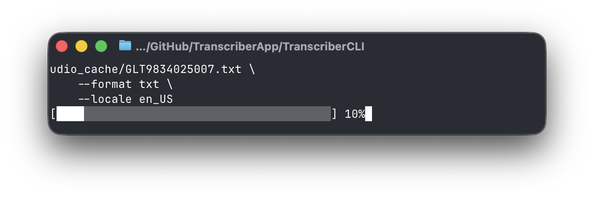

# Transcriber.app and Transcriber CLI

Local-first macOS 26+ (Tahoe) speech transcription app &amp; command-line tool (CLI). Uses `SpeechAnalyzer` and `SpeechTranscriber` to load appropriate models and transcribe without an internet connection.

Why use this? It runs locally, costs nothing, and can be easily integrated into another app or script.

## Transcriber.app



A simple drag-and-drop macOS application for transcribing audio files using Apple's `SpeechAnalyzer` API.

## Features

- 🎯 **Drag and Drop**: Simply drag audio files onto the app
- 🔄 **Queue Management**: Process multiple files sequentially
- 📊 **Progress Tracking**: Visual feedback for each transcription
- 📝 **SRT or TXT**: Generates SubRip (.srt) subtitle or plaintext (.txt) files
- 🎵 **Audio Support**: MP3, M4A, WAV, AIFF formats

## Requirements

- macOS 26.0+ (macOS Tahoe)
- Xcode with Swift 6.0+

## Building the App

```bash
swift build -c release
```

## Installation

After building:

```bash
# Copy to Applications folder
cp -r build/Transcriber.app /Applications/

# Or run directly
open build/Transcriber.app
```

## Usage

1. **Launch the app** - Double-click `Transcriber.app`
2. **Drag audio files** onto the drop zone
3. **Wait for processing** - Files are transcribed sequentially
4. **Find transcripts** - SRT files are created next to the original audio files

### Example

If you drop `podcast-episode.mp3`, the app will create `podcast-episode.srt` in the same directory.

## Troubleshooting

### "Transcriber.app is damaged and can't be opened"

This happens because the app isn't code-signed. To fix:

```bash
# Remove quarantine attribute
xattr -cr /Applications/Transcriber.app
```

### "TranscriberCLI not found"

The CLI must be bundled in the app's Resources folder. Rebuild using `build_app.sh`.

### Files aren't being transcribed

Check that:

1. You have macOS 26+ (Tahoe)
2. The audio files are in a supported format (MP3, M4A, WAV, AIFF)
3. You have disk space for the SRT files

## TranscriberCLI



This CLI tool runs `SpeechAnalyzer` locally to generate TXT or SRT transcriptions of an audio or video file. If built locally, the tool will be located in `.build/release/TranscriberCLI`. Displays a progress bar with how far along transcription is.

### CLI Usage

```bash
TranscriberCLI --input-path ./ABC123.mp3 \
    --output-file ./ABC123.srt \
    --format srt \
    --locale en_US
```

There are four parameters:

- `--input-path` (required): path to an audio or video file
- `--output-path` (required): path to where the transcript should be written
- `--format` (optional): defaults to `txt`. Values `srt` or `txt` only
- `--locale` (optional): defaults to your system locale via `Locale.current.identifier`

## Legal

Licensed under the [Apache 2.0](./LICENSE) license. Developed by [Tom Barrasso](https://barrasso.me).
